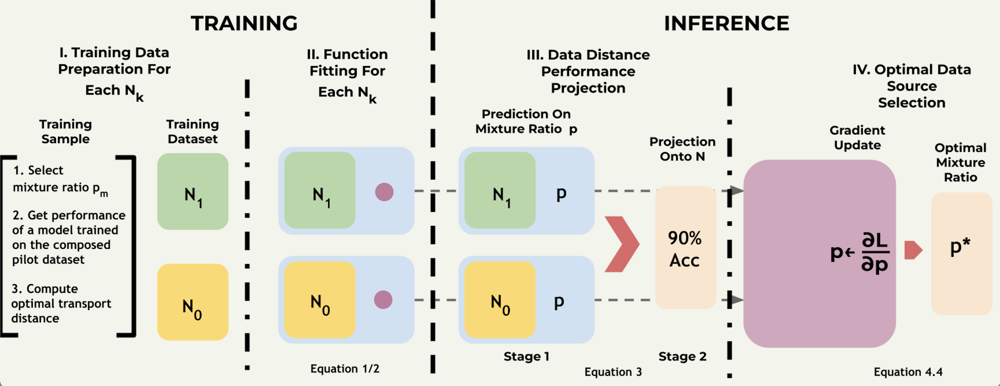

# [Projektor-NeurIPS 2023] Performance Scaling via Optimal Transport: Enabling Data Selection from Partially Revealed Sources

This repository is the official implementation of the "[Performance Scaling via Optimal Transport: Enabling Data Selection from Partially Revealed Sources](https://arxiv.org/abs/2307.02460)" (NeurIPS 2023). 

We propose a performance estimator for a model trained on any data source composition given limited sample information.
We further develop a novel optimal transport based scaling law to predict performance on larger scales, which effectively finds the optimal composition of data sources for
any target data size.

# Getting Started

                        
## Examples

For better understanding of applying **projektor** to data source selection and performance scaling, we have provided a tutorial Jupyter notebook `projektor_cifar10_example.ipynb`.

## Data

The datasets should be placed in the folder ['data'](data).
Please download the necessary datasets, e.g. CIFAR10.

## Acknoledgment

RJ and the ReDS lab acknowledge support through grants from the Amazon-Virginia Tech Initiative
for Efficient and Robust Machine Learning, the National Science Foundation under Grant No.
IIS-2312794, NSF IIS-2313130, NSF OAC-2239622, and the Commonwealth Cyber Initiative

